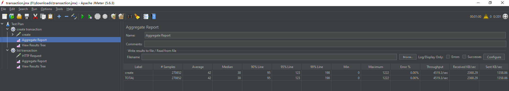
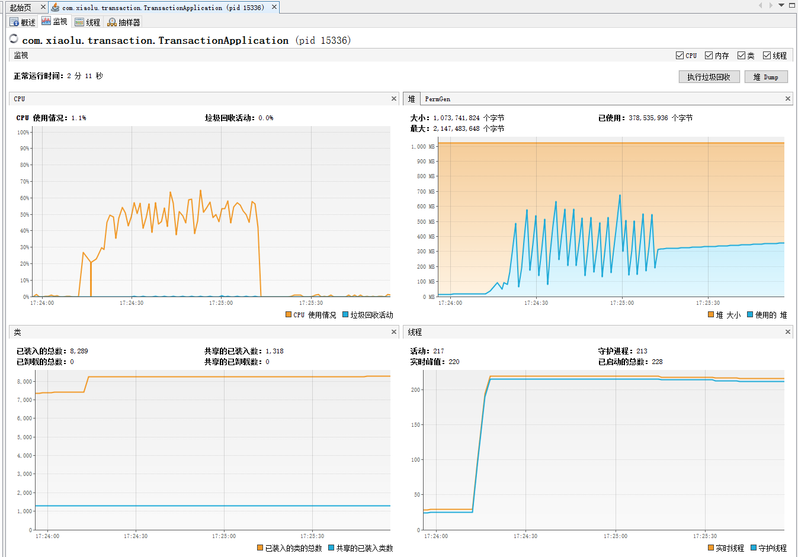
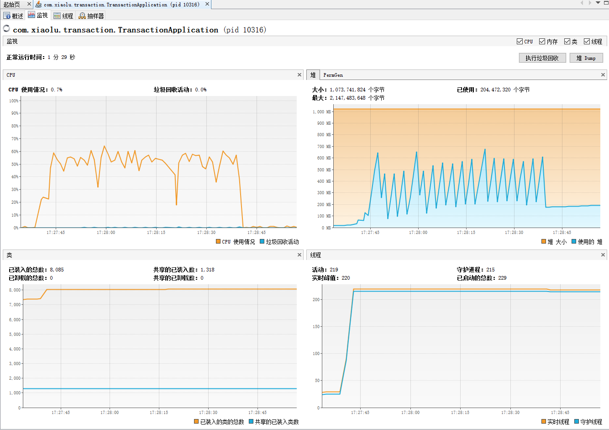
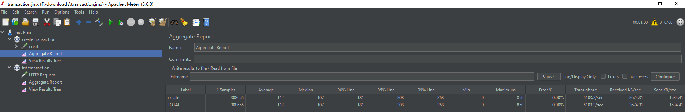
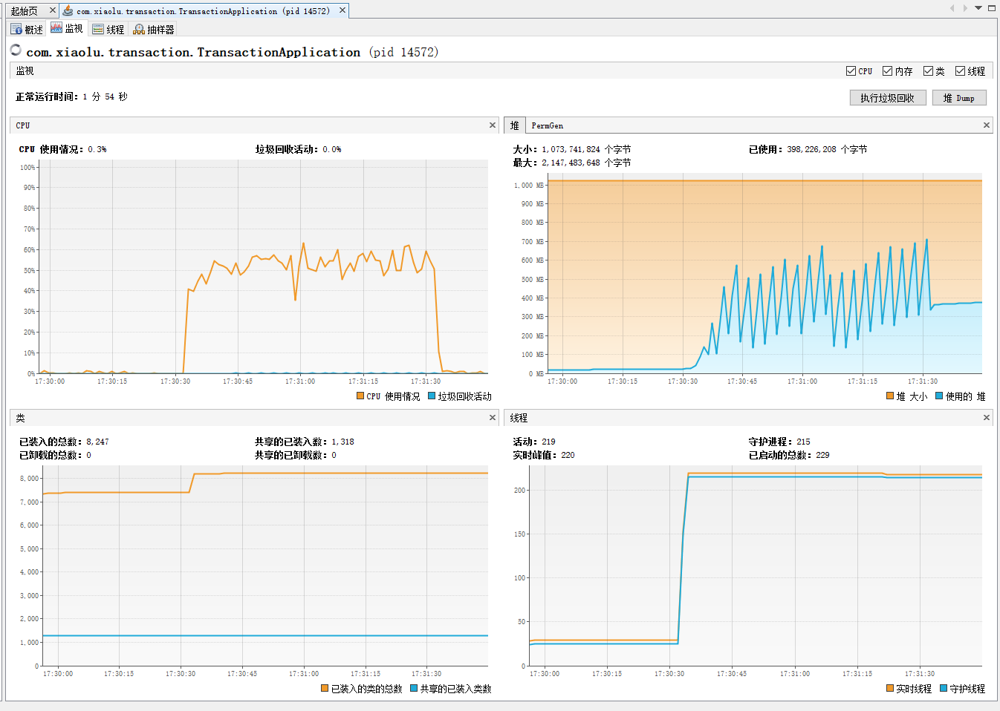
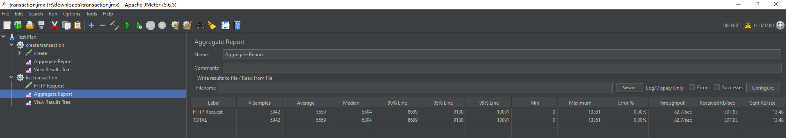
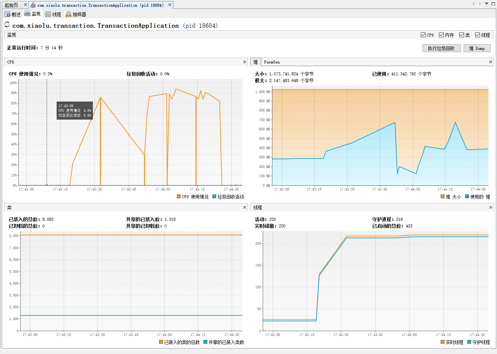
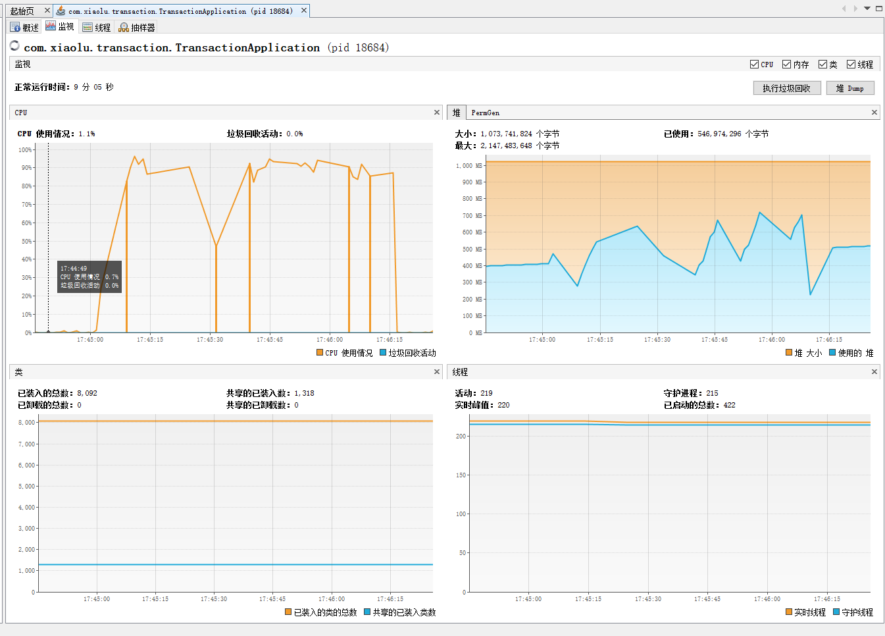

## 压测报告

### 测试环境
* azul-jdk-21.0.5
* apache-jmeter-5.6.3
* 内存配置：-Xms1024m -Xmx1024m
* CPU：Intel(R) Core(TM) i5-4590 CPU @ 3.30GHz
* 服务节点数：1
* [jmeter压测配置文件](transaction.jmx)

可使用以上环境复现及验证

### 测试说明
此压测目的是看在高并发下服务状态是否正常，是否能正常返回数据，
不是要测试服务的极限是多少，或者在给定负载下所需要的系统资源配置是多少

### 场景说明
选取操作类及查询类各一个接口，以下场景假定了一个估算并发值

### 交易创建接口
估算单节点高峰期的并发为300，这里使用峰值并发的60%，100%，200%，即并发200，300,600进行三次测试
压测都持续1分钟
#### 场景1：并发200
jmeter测试结果：

visualVm监控：

#### 场景2：并发300
jmeter测试结果：

visualVm监控：

#### 场景3：并发600
jmeter测试结果：

visualVm监控：

总结：在60%，100%，200%预期峰值并发下，服务状态表现良好，CPU使用率高峰在60%左右，内存使用约400M，峰值约600M，使用率基本在40%左右，
说明服务在高负载下依然能保持可用

### 交易查询接口
因为本身查询接口并发相对更高，但是服务做了缓存，预期服务状态在高并发下依然表现良好，这里使用500并发和1000并发对单节点进行压测，持续1分钟，查询服务状态
#### 场景1：并发500
jmeter测试结果(下图显示jMeter线程数已达到1100)：

visualVm监控：

#### 场景2：并发1000
jmeter测试结果(下图显示jMeter线程数已达到1600)：

visualVm监控：

总结：在500，1000并发下，CPU使用率在80%-90%左右,内存使用约400M，峰值约700M，使用率基本在40%左右，
其中CPU使用率在高并发下使用率较大，内存使用正常，若实际预期会超过此并发时，可增加节点数量进行扩容或者升级CPU配置